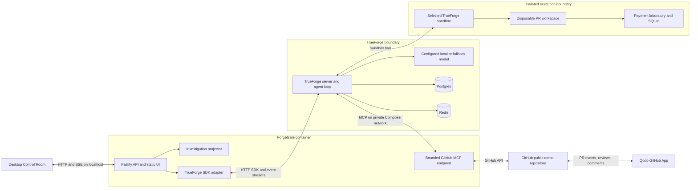
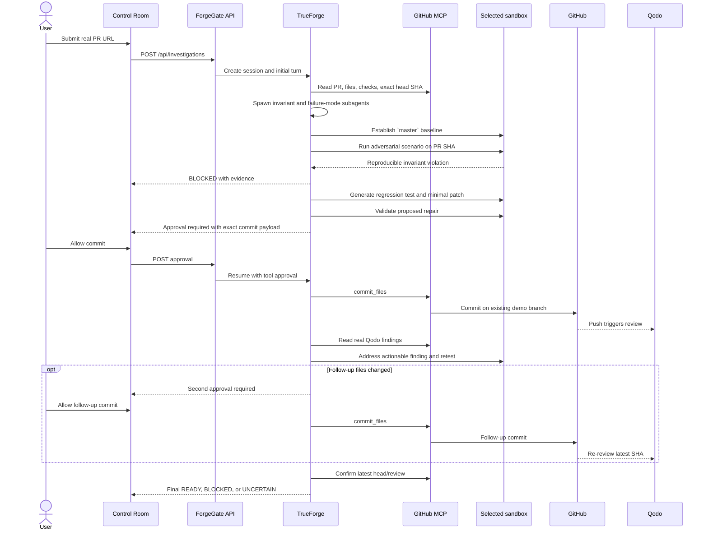
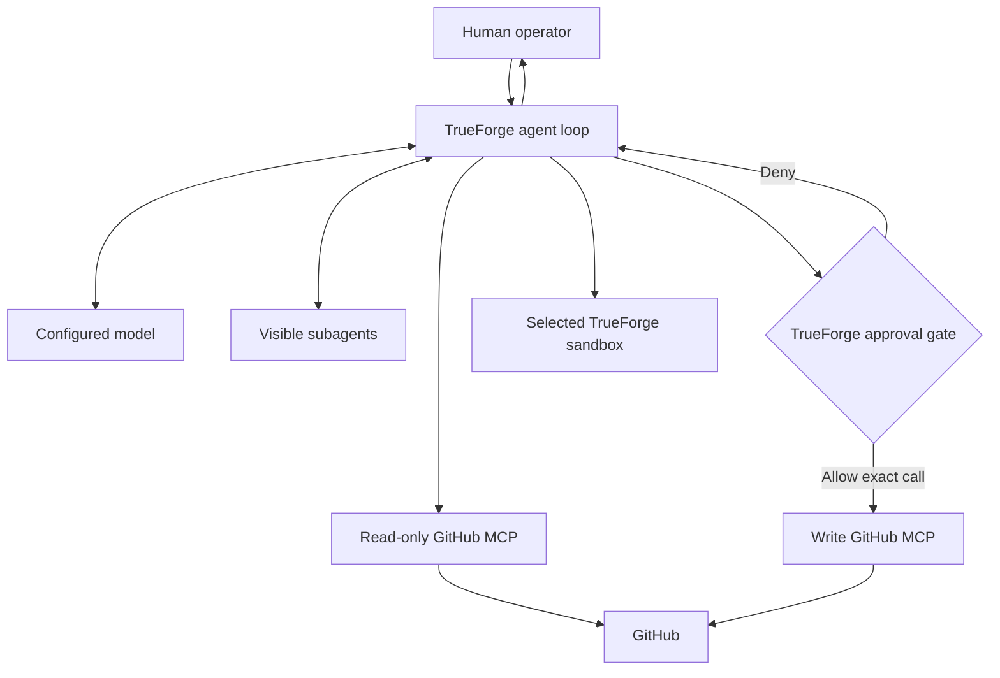
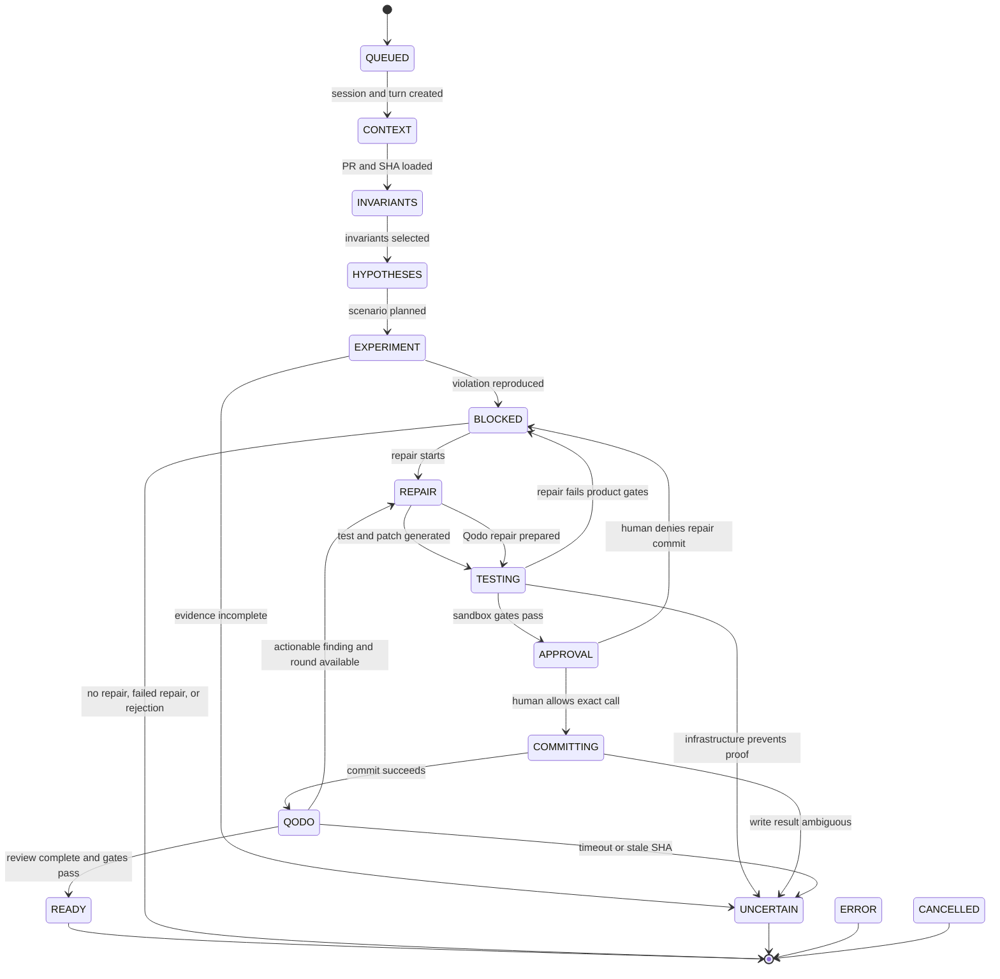

# ForgeGate End-to-End Project Plan

## 1. Product and Local Architecture

### Outcome

ForgeGate evaluates whether a payment-service pull request is safe by:

1. Reading a real GitHub PR through MCP.
2. Discovering evidence-supported business invariants.
3. Generating adversarial failure scenarios.
4. Running them in the selected TrueForge sandbox.
5. Returning `READY`, `BLOCKED`, or `UNCERTAIN`.
6. Generating a regression test and minimal patch.
7. Pausing for human approval before committing.
8. Processing Qodo's review and testing again.

ForgeGate never merges or deploys automatically.

### Product promise

> Don't trust a code change because the tests pass. Let an agent try to break it first.

### Fixed stack

- Node.js 24 with strict TypeScript.
- React 19 and Vite.
- Fastify server.
- pnpm workspace.
- TrueForge TypeScript SDK.
- Official MCP TypeScript SDK and Octokit.
- Local Qwen3.5 4B through an Ollama OpenAI-compatible endpoint.
- TrueForge local sandbox fallback under WSL2 as the Phase 1 preference; Daytona only if that feasibility proof fails.
- `node:sqlite` payment laboratory.
- Vitest and Playwright.
- Docker Compose.
- Postgres and Redis for TrueForge persistence.

### Local model and sandbox decision - 2026-08-25

- ChatGPT Plus is a ChatGPT application subscription and does not provide API usage, so it is not a ForgeGate model credential.
- The primary zero-cost model is the locally available Qwen3.5 4B served through Ollama's OpenAI-compatible endpoint and configured as a TrueForge custom provider.
- TrueForge runs inside WSL2 so the local fallback sees Linux instead of `win32`. Phase 1 must prove that this fallback actually provides the required sandbox events, execution, cleanup, and isolation.
- TrueForge's current public documentation lists Daytona as the only supported sandbox provider. Therefore local fallback is a feasibility experiment, not a guaranteed capability; Daytona is explored only if the local proof fails.
- All later OpenAI references describe the replaceable model layer, and all later Daytona references describe the selected TrueForge sandbox, unless a section explicitly discusses those services.
- Qwen3.5 4B must pass structured output, tool calling, subagent, patch generation, and deterministic workflow checks before feature implementation depends on it. Failure reopens model selection; it does not automatically require OpenAI.

### Local topology

```text
Desktop browser
      | localhost
      v
  ForgeGate
    |-- React Control Room
    |-- TrueForge event adapter
    `-- private GitHub MCP server
             |
             |----> GitHub demo repository ----> Qodo
             |
             v
         TrueForge
           |-- Qwen3.5 4B through Ollama
           |-- selected sandbox
           |-- subagents
           |-- approvals
           `-- Postgres + Redis
```

All containers bind to `127.0.0.1`. Docker Desktop uses its WSL2 Linux backend, avoiding the native Windows TrueForge errors already encountered.

Use one public repository containing ForgeGate, its MCP server, agent skill, payment laboratory, unsafe fixture, Docker configuration, tests, and documentation.

TrueForge remains the source of truth for sessions and events. ForgeGate requires no separate application database.

### Hackathon alignment

ForgeGate must visibly demonstrate:

- A real MCP tool reaching GitHub.
- Agent-generated work executing in an isolated sandbox.
- Work delegated to visible subagents.
- A session surviving refresh or reconnect.
- A human approval pause before every GitHub write.
- Qodo reviewing real implementation and generated-patch PRs.
- A clear three-minute failure-to-recovery story.

The six judging criteria remain equally important:

1. Potential impact.
2. Creativity and originality.
3. Technical excellence.
4. Use of sponsor tools.
5. Control and safety.
6. Presentation.

## 2. Interfaces and Agent Behaviour

### HTTP interface

- `POST /api/investigations`
  - Accepts the demo PR URL.
  - Validates the configured repository.
  - Creates a TrueForge session and starts ForgeGate.

- `GET /api/investigations/:sessionId`
  - Reconstructs the investigation from persisted TrueForge events.

- `GET /api/investigations/:sessionId/events`
  - Streams events over SSE.
  - Supports reconnection through `Last-Event-ID`.
  - Uses the strictly monotonic TrueForge `sequence` as the canonical SSE cursor and deduplication key; `eventId` is retained for tracing and cross-checking only.

- `POST /api/investigations/:sessionId/approvals/:approvalId`
  - Answers an actual pending TrueForge approval.

- `POST /api/investigations/:sessionId/cancel`
  - Cancels the turn and releases its sandbox.

- `GET /health/live` and `GET /health/ready`
  - Report application and dependency health.

No authentication is needed for the localhost MVP.

### Investigation model

```text
Status:
QUEUED | RUNNING | PAUSED | BLOCKED | UNCERTAIN |
READY | ERROR | CANCELLED

Stage:
CONTEXT | INVARIANTS | HYPOTHESES | EXPERIMENT |
EVIDENCE | REPAIR | TESTING | APPROVAL | COMMITTING |
QODO | DECISION

Source:
SYSTEM | GITHUB | AGENT | SUBAGENT |
SANDBOX | QODO | HUMAN
```

`Stage` is the canonical public stage union. The SSE envelope `stage` field,
projector state, persisted investigation snapshot, and desktop stage
progression must use only these values. `Status` values such as `BLOCKED`,
`READY`, and `UNCERTAIN` are not stage values and must not be emitted through
the `stage` field.

### Structured artifacts

- `InvariantCandidate`
  - Statement, confidence, and at least two repository evidence references.
- `ScenarioPlan`
  - Invariant ID, deterministic seed, injected faults, ordering, and expected outcome.
- `ExperimentResult`
  - Tested SHA, expected and observed values, repetitions, verdict, and artifact links.
- `PatchProposal`
  - Expected head SHA, changed files, diff, and regression-test result.
- `QodoFinding`
  - Review URL, severity, actionability, status, and response.
- `DecisionReport`
  - Decision, tested SHA, passed and failed gates, remaining uncertainty, and evidence.

The UI displays actual tool activity, event metadata, and concise agent summaries. It never fabricates or displays hidden model reasoning.

### GitHub MCP tools

Read operations:

- `get_pull_request`
- `get_pull_request_files`
- `get_file`
- `get_checks`
- `get_qodo_reviews`
- `get_review_comments`

Approval-gated writes:

- `commit_files`
- `comment_on_pull_request`
- `request_qodo_review`

Every write enforces:

- Configured demo repository.
- Branch prefix `forgegate/demo-`.
- Path prefix `payment-lab/`.
- Expected PR head SHA.
- Maximum 10 files and 250 KB.
- No force-push, merge, workflow modification, branch deletion, or PR closure.

### Agent workflow

1. Load the PR and exact head SHA.
2. Delegate to two visible subagents:
   - Invariant analyst.
   - Failure-mode analyst.
3. Require repository evidence for each invariant.
4. Establish safe behaviour from `master`.
5. Check out the PR head in the selected TrueForge sandbox.
6. Generate a deterministic fault scenario.
7. Execute the payment laboratory and invariant oracle.
8. Return `BLOCKED` when the violation reproduces.
9. Generate a regression test and minimal patch.
10. Rerun tests and the adversarial experiment.
11. Pause through TrueForge before committing.
12. Show the exact diff and supporting evidence.
13. Commit only after local user approval.
14. Wait for Qodo's real review.
15. Classify findings as actionable, informational, or disputed.
16. Address actionable findings.
17. Rerun tests and experiments on the latest SHA.
18. Pause before any follow-up commit.
19. Request Qodo re-review.
20. Produce the final decision.

### Decision rules

- `BLOCKED`
  - A reproducible invariant violation exists at the current PR head.
- `READY`
  - Required experiments pass.
  - The tested SHA remains current.
  - Regression tests pass.
  - Qodo completed its review.
  - Actionable findings are resolved.
  - No approval remains pending.
- `UNCERTAIN`
  - Evidence is missing or unsupported.
  - The PR head changed after testing.
  - Sandbox, connector, or model execution failed.
  - Results are flaky or inconsistent.
  - Qodo did not complete within the configured timeout.

A technical failure never defaults to safe.

## 3. Payment Laboratory and Desktop Control Room

### Payment laboratory

Implement a compact TypeScript payment system with:

- Payment intent state machine.
- Fake payment provider.
- SQLite charge and ledger tables.
- Retry worker.
- Duplicate webhook handler.
- Idempotency handling.
- Deterministic fault scheduler.
- Independent invariant oracle.

### Primary invariant

> One payment intent produces exactly one charge and one ledger entry.

### Supporting invariants

- A retry remains idempotent.
- A duplicate webhook cannot create another charge.
- Payment state cannot move backwards.
- A failed payment cannot be recorded as settled.
- Provider charges and ledger entries reconcile.

### Adversarial scenario

```text
provider timeout
-> retry
-> duplicate webhook
-> concurrent retry
```

Unsafe result:

```text
100 payment intents
102 provider charges
100 ledger entries
BLOCKED
```

Repaired result:

```text
1,000 payment intents
1,000 provider charges
1,000 ledger entries
READY
```

### Repeatable demo preparation

Provide:

```bash
pnpm demo:seed
```

It:

1. Creates `forgegate/demo-<timestamp>` from `master`.
2. Applies the unsafe retry fixture.
3. Opens a real GitHub PR.
4. Prints the PR URL.

It never resets, force-pushes, or deletes an existing branch. Each rehearsal receives a fresh PR and preserves its Qodo history.

### Desktop Control Room

Target desktop browsers at widths of 1024px and above, optimized for 1280-1440px recording.

Visual direction:

- Dark, dense operations-console interface.
- Slate surfaces.
- Green for verified passage.
- Amber for uncertainty.
- Red for reproduced failure.
- IBM Plex Sans and JetBrains Mono.
- Lucide SVG icons.
- No color-only status communication.
- CSS transform and opacity transitions.
- Reduced-motion support.

Layout:

- Header: repository, PR, SHA, elapsed time, and decision.
- Left rail: investigation stage progression.
- Centre: invariants, hypotheses, and live experiment execution.
- Right rail: evidence, expected versus observed values, and approvals.
- Bottom panel: TrueForge event timeline and raw-event inspector.

Required states:

- No PR selected.
- Connecting.
- Running.
- Approval required.
- Blocked.
- Repairing.
- Waiting for Qodo.
- Ready.
- Uncertain.
- Error.
- Cancelled.
- Reconnecting.

Desktop accessibility remains required:

- Keyboard-operable controls.
- Visible focus indicators.
- Semantic headings and landmarks.
- Accessible approval dialog.
- Live-region announcements for important state changes.
- Minimum 4.5:1 text contrast.
- Reduced-motion support.

Mobile navigation, touch optimization, mobile breakpoints, and mobile visual testing are explicitly deferred.

## 4. Ordered Implementation Plan

### Phase 1 - Workflow and feasibility

- Install Qodo immediately.
- Protect `master` and use PRs for implementation.
- Scaffold TypeScript, CI, and Docker.
- Start TrueForge, Postgres, and Redis through Compose.
- Configure Qwen3.5 4B through local Ollama and attempt the TrueForge local sandbox fallback from WSL2.
- Treat failure of either local capability as a feasibility result: then evaluate a stronger accessible model and/or Daytona before continuing to dependent phases.
- Prove one MCP call, sandbox command, subagent, reconnect, and rejected approval.

Acceptance:

- `docker compose up` works through Docker Desktop and WSL2.
- ForgeGate and TrueForge health checks pass.
- Qwen produces valid structured output and executes one MCP tool call, one subagent, and one bounded patch/test task.
- The selected sandbox emits real TrueForge events, contains file/command execution, and cleans up without exposing credentials.
- Rejected approval performs no GitHub mutation.

### Phase 2 - Payment laboratory

- Build the safe payment workflow.
- Add SQLite repositories and invariant oracle.
- Add deterministic failure injection.
- Create the unsafe fixture.
- Add `demo:seed`.

Acceptance:

- Main passes 20 consecutive runs.
- Unsafe fixture fails 20 consecutive runs with identical evidence.
- A fresh real PR can be created safely.

### Phase 3 - Read-only investigation

- Implement bounded GitHub read tools.
- Create the ForgeGate skill and agent specification.
- Implement invariant and failure-mode subagents.
- Generate structured artifacts.
- Map TrueForge events into investigation stages.

Acceptance:

- A demo PR reaches a real `BLOCKED` decision.
- MCP, subagent, and selected-sandbox activity is visible from real events.

### Phase 4 - Repair and approval

- Generate the regression test and minimal patch.
- Add all GitHub write guards.
- Render the proposed diff.
- Implement TrueForge approval handling.
- Commit after approval.

Acceptance:

- Reject performs zero writes.
- Approve creates one bounded commit.
- Stale SHA and invalid paths fail closed.

### Phase 5 - Qodo loop

- Read Qodo reviews and comments.
- Classify findings.
- Fix actionable findings.
- Rerun the complete experiment.
- Request approval for follow-up writes.
- Request Qodo re-review.

Acceptance:

- Qodo's real review appears in the Control Room.
- The final decision references the latest reviewed and tested SHA.

### Phase 6 - Desktop UI and reliability

- Complete the desktop stage progression.
- Add invariant, experiment, evidence, and Qodo views.
- Add approval and final-decision views.
- Add SSE reconnection and event deduplication.
- Add all required states.
- Verify 1024px, 1280px, and 1440px layouts.

Acceptance:

- Refresh restores the running session.
- Events are not duplicated.
- Keyboard-only operation works.
- The primary flow is clear at the demo-recording resolution.

### Phase 7 - Submission

- Verify setup from a clean clone.
- Confirm Qodo reviewed meaningful PRs.
- Rehearse with a fresh demo PR.
- Record the approximately three-minute video.
- Publish README, architecture, security model, and AI-assistance disclosure.
- Submit the repository, video, and write-up.

### Deferred work

Only consider these after all submission requirements pass:

- Mobile UI.
- Public cloud deployment.
- Authentication and public-use quotas.
- Arbitrary repository support.
- Additional business domains.

## 5. Verification and Boundaries

### Automated verification

- Invariant oracle.
- Deterministic fault scheduler.
- Decision rules.
- Event reconstruction and deduplication.
- GitHub repository, branch, path, SHA, and size guards.
- Approval rejection with zero writes.
- Baseline pass, unsafe failure, and repaired pass.
- Qodo timeout producing `UNCERTAIN`.
- Browser refresh during execution.
- Keyboard and reduced-motion desktop tests.

### Live demo acceptance

- ForgeGate runs locally through Docker.
- It reads a real GitHub PR through MCP.
- TrueForge delegates to visible subagents.
- The selected TrueForge sandbox executes the generated scenario.
- The unsafe PR produces a duplicate-payment violation.
- ForgeGate generates a regression test and patch.
- TrueForge visibly pauses before the GitHub write.
- Approval creates a real commit.
- Qodo reviews it.
- ForgeGate addresses a finding and tests again.
- The decision transitions from `BLOCKED` to `READY`.
- The demonstration fits approximately three minutes.

### Three-minute demo outline

- `0:00-0:20`: Show the retry PR and primary business invariant.
- `0:20-0:55`: Show MCP context retrieval and subagent delegation.
- `0:55-1:20`: Show the generated adversarial scenario.
- `1:20-1:45`: Reveal `102 charges` and the `BLOCKED` decision.
- `1:45-2:10`: Generate and validate the regression test and patch.
- `2:10-2:30`: Show the real Qodo review and agent response.
- `2:30-2:50`: Show the TrueForge approval pause and approve the commit.
- `2:50-3:00`: Show `1,000/1,000/1,000` and `READY`.

### Explicit exclusions

- No mobile UI.
- No public cloud requirement.
- No authentication.
- No autonomous merge or deployment.
- No arbitrary repository or language support.
- No multi-tenant SaaS.
- No Kubernetes.
- No separate ForgeGate database.
- No generic chaos platform.
- No mocked activity in the submitted demo.

# Architecture and Design Extension

This appendix makes the established implementation plan architecture-ready. It is additive: when it clarifies an ambiguity or flags a contradiction, it does not silently replace the original requirement.

## 1. System Architecture

### Architecture principles

- TrueForge is the agent runtime and durable source of orchestration truth.
- ForgeGate is a thin product layer: desktop UI, API adapter, event projection, and bounded GitHub MCP tools.
- The selected TrueForge sandbox is the only place where untrusted repository code, generated code, shell commands, tests, and experiments execute.
- GitHub mutations occur outside the sandbox through bounded MCP tools and only after a TrueForge approval.
- Qodo remains an independent reviewer operating on the real GitHub PR.
- The local MVP uses one browser origin, no ForgeGate database, no application login, and no public network exposure.

### High-level architecture



### Components and communication

| Component | Responsibility | Inputs | Outputs | Dependencies | Communication |
|---|---|---|---|---|---|
| Desktop Control Room | Starts an investigation and makes harness work, evidence, approvals, and decisions visible | PR URL, approval/rejection, cancel action, SSE events | API commands, rendered Agent Run, evidence, final decision | ForgeGate API | Same-origin HTTP and SSE |
| Fastify API | Validates requests, creates/resumes TrueForge work, serves React, and exposes health endpoints | Browser requests, TrueForge events | API responses, SSE stream, static assets | TrueForge adapter, projector | HTTP mapped only to `127.0.0.1` |
| Investigation projector | Converts persisted TrueForge events into status, stage, artifacts, and Agent Run steps | Sessions, turns, events, deltas | `InvestigationSnapshot`, normalized UI events | TrueForge SDK event types | In-process calls |
| TrueForge adapter | Creates sessions/turns, streams/replays events, submits approvals, and cancels work | Validated investigation commands | TrueForge IDs, events, terminal state | TrueForge SDK | HTTP/SSE on private Compose network |
| ForgeGate agent | Coordinates evidence, subagents, experiments, repair, approval, Qodo, and final decision | PR URL and session context | Structured artifacts, tool calls, decision report | Configured model, MCP, selected sandbox, skill | TrueForge agent loop |
| Configured model | Produces hypotheses, structured artifacts, patches, and classifications | Agent context and tool results | Model messages and structured output | Local Qwen primary; hosted provider optional | Provider endpoint called only by TrueForge |
| GitHub MCP endpoint | Exposes minimum GitHub tools and enforces repository, branch, path, size, and SHA policies | Schema-validated MCP calls | Normalized GitHub data or typed errors | Octokit, server-side PAT | Streamable HTTP privately; GitHub REST externally |
| Selected TrueForge sandbox | Isolates checkout, generated files, commands, tests, and experiments | Tested SHA, scenario, commands, patch | Exit codes, bounded logs, diffs, artifacts | WSL2 local fallback experiment; Daytona optional | TrueForge sandbox tool |
| GitHub | Owns repository, PR, commits, checks, comments, and reviews | MCP calls and Qodo events | Durable repository evidence | PAT, Qodo GitHub App | HTTPS API/webhooks |
| Qodo | Independently reviews implementation and generated-patch commits | Real GitHub PR state | Findings, comments, checks, review links | Qodo GitHub App | GitHub; ForgeGate reads via MCP |
| Postgres | Persists TrueForge agents, sessions, turns, events, and approvals | TrueForge writes | Durable orchestration state | TrueForge | Private DB connection |
| Redis | Supports TrueForge runtime coordination | Transient TrueForge data | Runtime coordination | TrueForge | Private Redis connection |
| Payment laboratory | Supplies deterministic system, fixture, fault scheduler, and invariant oracle | Seed and fault schedule | Charges, ledger, tests, `result.json` | `node:sqlite`, Vitest | Inside selected sandbox only |

### Deployment and authorization boundary

- Docker Desktop runs Linux containers through WSL2; native Windows execution is unsupported for this project.
- Fastify serves the production Vite build and `/api`. Development may use a Vite proxy, but the demo uses one origin.
- The MCP endpoint is reachable by TrueForge on the private Compose network and is not published publicly.
- TrueForge OIDC is disabled for this localhost MVP. The browser never receives provider, GitHub, database, or Redis credentials.
- All published host ports bind to `127.0.0.1`. Public exposure requires authentication and remains deferred.

## 2. Component Architecture

| Module | Responsibility | Key interfaces | Dependencies | Important data owned | Boundary |
|---|---|---|---|---|---|
| Control Room shell | Desktop layout, routing, connection state, accessibility, decision presentation | Investigation form, SSE subscription, approval dialog, cancel | Browser API client | Ephemeral UI state | Never infers success or fabricates steps |
| Agent Run panel | Makes harness activity the primary narrative | Normalized `HarnessStep`, evidence expansion, approval card | Projector | Presentation-only expansion state | Every step traces to a real event/artifact |
| Investigation API | Public ForgeGate HTTP contract | Create, get, events, approval, cancel, health | Validation, TrueForge adapter | No durable state | No agent reasoning or GitHub policy logic |
| Investigation projector | Replays/folds TrueForge events into a stable snapshot | `project(events)`, normalized envelope | TrueForge delta helpers | In-memory event index | Rebuildable; TrueForge remains authoritative |
| TrueForge adapter | SDK-specific session, turn, stream, replay, approval, cancel logic | Create/subscribe/replay/approve/cancel | TrueForge SDK | Active stream handles only | Does not duplicate persistence |
| Agent specification | Model, instructions, MCP, sandbox, subagents, approvals, response format, limits | TrueForge `AgentSpec` | Skill and catalogs | Saved definition in TrueForge | Cannot bypass configured tools |
| ForgeGate skill | Domain workflow, evidence hierarchy, gates, stopping rules | `SKILL.md` | Sandbox-enabled agent | Versioned instructions | No credentials/runtime state |
| GitHub MCP server | GitHub interactions and write guards | Established MCP tools | MCP SDK, Octokit, PAT | Allowlists only | Sole agent path to GitHub |
| Write-policy guard | Validates mutation immediately before Octokit | Repo/branch/path/SHA/file/size checks | MCP server | Immutable configured limits | Model text cannot override it |
| Payment laboratory | Business-risk proof and repair verification | Baseline, scenario, oracle | Node, SQLite | Disposable lab artifacts | Selected-sandbox checkout only |
| Qodo adapter | Converts GitHub review material to `QodoFinding` | Review/comment/check readers | GitHub MCP | No durable state | Never manufactures findings |
| Demo seed CLI | Creates fresh unsafe branch and PR | `pnpm demo:seed` | Octokit or selected GitHub CLI | No retained state | Explicit operator action, not agent work |

Shared contracts are limited to the established artifacts plus `InvestigationSnapshot`, `HarnessEvent`, `HarnessStep`, and the API error envelope. Do not create generic workflow, provider, sandbox, or reviewer abstractions for the MVP.

## 3. Critical User Flows

### Primary happy path

**Trigger:** The user submits the seeded unsafe PR URL.

**Actors:** User, Control Room, Fastify API, TrueForge, configured model, subagents, GitHub MCP, selected sandbox, GitHub, and Qodo.



**State:** `QUEUED` -> context/analysis/experiment -> `BLOCKED/EVIDENCE` -> repair/testing -> `PAUSED/APPROVAL` -> `QODO` -> `READY/DECISION`.

**Success:** The defect reproduces, approved repair passes, Qodo completes, actionable findings resolve, and reviewed SHA equals tested SHA.

**Failure:** Missing evidence, stale SHA, flaky result, dependency failure, or Qodo timeout prevents `READY`.

**Approvals:** Initial commit, any follow-up commit, and any PR/Qodo trigger comment.

**Outcome:** Evidence-backed `READY`, `BLOCKED`, or `UNCERTAIN`; never merge or deploy.

### Required flow matrix

| Flow | Trigger and steps | Tools/state changes | Success | Failure/recovery | Approval and outcome |
|---|---|---|---|---|---|
| Agent planning/execution | Initial turn; validate scope, read PR/SHA, delegate analysts, reconcile evidence, baseline `master`, plan and run scenario | GitHub reads, subagents, selected sandbox; `CONTEXT` -> `INVARIANTS` -> `HYPOTHESES` -> `EXPERIMENT` | Supported invariant and deterministic result | Bounded transient retries; missing proof -> `UNCERTAIN` | No approval for reads/isolation; produces violation or safe evidence |
| Code modification | Reproduced violation; create failing regression test, minimal patch, validate paths/limits, show diff | Selected sandbox only; `BLOCKED` -> `REPAIR` -> `TESTING` -> `APPROVAL` | Test fails before and passes after patch; scenario passes | Invalid/failed repair remains `BLOCKED`; infrastructure ambiguity -> `UNCERTAIN` | Approval before `commit_files`; approved commit or no write |
| Testing/validation | Initial PR, proposed repair, or Qodo repair | Build/tests/scenario/oracle in selected sandbox; exact SHA/seed/results recorded | Required repetitions and counts pass | Product failure is evidence; flaky output -> `UNCERTAIN` | No sandbox approval; emits `ExperimentResult` |
| Qodo review | Approved commit lands | Review/comment/check reads, sandbox repair, optional gated trigger/commit; `QODO` -> optional repair -> decision | Latest tested SHA reviewed, no actionable finding | Timeout/integration/stale review -> `UNCERTAIN`; unresolved risk -> `BLOCKED` | One repair round; any write needs approval |
| Git/branch/commit/PR | Operator seeds; agent later gets patch approval | Seed CLI, PR read, guarded `commit_files` | Exact approved files form one commit on existing PR branch | SHA/path/size/auth conflict fails closed | Seed is operator action; agent write is gated |
| Failure/recovery | Tool/model/stream/sandbox/Qodo/GitHub failure | Typed retry, replay/reconnect, cancel/dispose; current stage -> safe status | Resume without duplicated writes/events | Exhaustion -> `BLOCKED`, `UNCERTAIN`, `ERROR`, or `CANCELLED` | Changed mutation arguments require new approval |
| Irreversible action | TrueForge intercepts configured write tool | `tool.approval_required`, approval API, resumed turn | Exact displayed call runs once | Missing/mismatched/stale/duplicate approval fails closed | Allow executes once; deny performs zero writes |

## 4. Agent Architecture

### Responsibilities

1. Anchor claims to the exact PR SHA.
2. Discover invariants from repository evidence rather than inventing them.
3. Delegate invariant and failure-mode analysis to visible subagents.
4. Generate deterministic adversarial scenarios.
5. Execute generated work only in the selected TrueForge sandbox.
6. Separate product failure from infrastructure failure.
7. Generate a failing regression test before the minimal repair.
8. Request approval before every GitHub mutation.
9. Process one actionable Qodo-review round and test again.
10. Produce a structured final decision with evidence and uncertainty.



The model has no direct GitHub, host-shell, database, provider-key, or sandbox-key access.

### Tool contract

| Tool/capability | When allowed | Input/output expectation | Failure behavior |
|---|---|---|---|
| GitHub reads | After PR URL validation | Configured repo/PR/ref/path -> bounded normalized JSON | Retry transient reads twice; auth/schema failure -> `UNCERTAIN` |
| Dynamic subagents | Invariant/hypothesis stages | Narrow role/evidence -> referenced structured findings | Discard unsupported output; root reconciles conflicts |
| Selected sandbox | Baseline, scenario, patch, tests | Exact ref/seed/commands -> exit code, bounded logs, files, result | Retry provisioning once; classify execution failure |
| `commit_files` | Only after validation and approval | Expected SHA, branch, message, bounded files -> commit/new head SHA | Guard/API conflict fails closed; no force-push |
| PR comment/Qodo trigger | Only when necessary and approved | Bounded comment/trigger -> URL/ID | Failure is visible and does not change code evidence |
| TrueForge approval | On configured write proposal | Exact tool-call allow/deny -> resumed events | Single-use, argument-bound |
| Cancel | User request/hard timeout | Session ID -> terminal cancel and sandbox stop | Idempotent |

### Decision, retry, and stop rules

- Reject invariants without at least two repository evidence references.
- Stop if `master` cannot establish expected safe behavior.
- Return `BLOCKED` when a deterministic violation reproduces; attempt repair only when minimal and testable.
- Never propose a commit until regression and full experiment pass in the selected sandbox.
- Invalidate evidence when PR head changes.
- Permit one Qodo-driven repair round; unresolved actionable findings prevent `READY`.
- Stop at TrueForge's configured iteration limit.
- Model/read transient errors: two retries. Selected-sandbox provisioning: one fresh-sandbox retry. Malformed structured output: one schema-feedback correction.
- Do not blindly retry ambiguous GitHub writes; read branch state first.
- Test/invariant failures are evidence, not infrastructure retries.
- Approval denial executes zero writes.
- Merge, deployment, force-push, deletion, workflow edits, credential access, and host commands never occur.

## 5. Execution Lifecycle / State Machine

The existing `Status`, `Stage`, and `Source` remain the public model:

- `Status` describes aggregate run/decision presentation.
- `Stage` describes the current operation.
- `Source` attributes each event.
- A `BLOCKED` decision may remain visible while `Stage` progresses through repair; only `DecisionReport` is final.



| From | To | Trigger | Required behavior |
|---|---|---|---|
| `QUEUED` | `RUNNING/CONTEXT` | Initial turn created | Begin event stream |
| Running | `PAUSED/APPROVAL` | Gated tool proposed | Display exact required action |
| `PAUSED/APPROVAL` | Running | Matching allow response | Resume with `user.tool_approval` |
| `PAUSED/APPROVAL` | `BLOCKED/DECISION` | Repair commit rejected | Execute no write; preserve unsafe finding |
| Running | `UNCERTAIN/DECISION` | Reliable evidence cannot complete | Stop unsafe progression |
| Running/paused | `CANCELLED` | User cancels | Cancel turn and release sandbox |
| Any | `ERROR` | ForgeGate cannot service/project request | Preserve correlation IDs and guidance |
| `QODO` | `READY/DECISION` | Latest SHA tested/reviewed and gates pass | Emit final report |

Only transitions that execute a GitHub mutation require approval. Sandbox writes are isolated and reversible.

## 6. Git and GitHub Workflow

### Branch and PR preparation

- Protect `master` and use PRs for implementation so Qodo builds a meaningful trail.
- Use one dedicated branch for each meaningful feature or milestone. Keep coherent commits on that branch; do not create a branch per edit or commit.
- Implement and test on the feature branch, push it, and open a GitHub PR for Qodo.
- Address actionable Qodo findings and explain disputed findings on the same branch/PR, rerun relevant tests, and push follow-up commits before merge.
- Do not commit directly to `master`. Do not merge, delete the branch, or force-push unless the user explicitly requests it.
- `pnpm demo:seed` creates `forgegate/demo-<timestamp>` from current `master`, applies the unsafe fixture, pushes it, and opens a non-draft PR.
- The seed command refuses to reuse, reset, overwrite, or delete a branch.
- The PR exists before ForgeGate starts; its URL and head SHA become investigation input.

### Generated commits

- The agent modifies only its selected-sandbox checkout until patch gates pass.
- `PatchProposal` contains expected head SHA, exact files/diff, regression result, and experiment evidence.
- After approval, `commit_files` re-reads the head and validates repository, branch, paths, file count, bytes, and SHA.
- The MCP server creates one commit and advances only the existing demo branch.
- The agent never receives GitHub credentials, runs `git push`, or creates another PR.
- A Qodo-driven fix follows the same process and creates at most one follow-up commit.

| Action | Policy |
|---|---|
| Read repository, PR, checks, reviews, comments | Automatic after validation |
| Clone/read/modify/test in selected sandbox | Automatic and isolated |
| Run `pnpm demo:seed` | Explicit operator command outside agent |
| Commit files, comment, or trigger Qodo | Mandatory TrueForge approval |
| Merge, deploy, force-push, delete branch, close PR, edit workflow | Prohibited |

### Failure, rollback, and recovery

- Stale SHA or policy failure creates no commit.
- On ambiguous write timeout, read branch state before retrying. Report success only if the expected commit landed; otherwise pause for human action.
- Failed sandbox changes disappear with the workspace.
- Recover a bad commit only through a fresh approval-gated corrective/revert commit; never rewrite history.
- Cancellation after a successful commit reports it and does not roll it back automatically.

## 7. Qodo Integration

### Workflow placement

Qodo reviews the project's implementation PRs and the generated repair commit. In the demo it necessarily runs after the first approved patch exists on GitHub; the agent then consumes findings and tests again.

### Inputs and outputs

- Qodo receives the real repository, history, and committed diff through its GitHub App. ForgeGate sends no code to a separate Qodo API.
- Qodo publishes summaries, findings, comments, statuses, and links on GitHub.
- ForgeGate reads only the current PR and records the reviewed SHA where available.
- `QodoFinding` stores review URL, comment ID, severity, summary, evidence, actionability, status, and response.

### Finding policy

- `actionable`: Relevant correctness, security, test, or maintainability concern; prepare a repair in the selected sandbox.
- `informational`: Retain in report; no patch required.
- `disputed`: Give repository/test evidence. Posting disagreement requires approval.
- Critical/actionable findings must resolve before `READY`.
- Allow one Qodo repair iteration including generation, full test, approval, commit, and re-review.
- Unresolved proven risk ends `BLOCKED`; unresolved review state ends `UNCERTAIN`.

### Trigger and readiness

- Configure Qodo to review non-draft PRs and each push where supported.
- Prefer automatic push review. If absent, `request_qodo_review` may post the trigger after approval.
- `QODO_REVIEW_TIMEOUT_SECONDS` defaults to 600 and is tuned from measured latency.
- `READY` requires latest PR head = latest tested SHA = latest completed Qodo review target, all tests/experiments passing, and no actionable finding or approval open.

## 8. Sandbox / Safety Boundaries

### Inside the selected sandbox

- Checkout the configured repository at exact `master`/PR SHAs.
- Install locked dependencies.
- Read evidence and generate scenarios, tests, and proposed patches.
- Run build, Vitest, payment scenarios, oracle, and bounded diagnostics.
- Create disposable SQLite databases and structured artifacts.
- Compute the proposed diff.

### Outside the selected sandbox

- Browser, Fastify, TrueForge, configured-model call, GitHub MCP, GitHub/Qodo, Postgres, Redis, Docker control, all credentials, approvals, and all GitHub mutations.

### Execution policy

- One fresh sandbox is associated with one investigation and exact PR SHA.
- Restrict file collection to the checkout; resolve paths and symlinks before accepting patch content.
- Never inject model-provider, GitHub, Qodo, database, Redis, or host credentials.
- Permit only dependency/repository retrieval egress where provider controls allow; the fake payment scenario needs no network.
- Record command, working directory, duration, exit code, and bounded/redacted output.
- Limit command time, output, artifacts, files, and bytes.
- Release the sandbox on completion, cancellation, timeout, or unrecoverable failure.

### Pauses and prohibitions

- No approval is needed for disposable sandbox changes.
- Approval is mandatory before every commit, comment, Qodo trigger, corrective commit, or revert.
- Merge, deployment, branch deletion, PR closure, force-push, workflow edits, secret retrieval, host commands, and writes outside `payment-lab/` remain prohibited.

## 9. Backend API Design

### Common error contract

Use a single `ApiError` envelope with `code`, human-readable `message`, and optional `details`. It never contains credentials, hidden model reasoning, or unrestricted output.

### Endpoints

| Method and endpoint | Purpose | Request | Success response | Relevant errors |
|---|---|---|---|---|
| `POST /api/investigations` | Validate PR and start session/turn | Optional `Idempotency-Key`; `CreateInvestigationRequest` | `202 CreateInvestigationResponse` | `400`, `409`, `422`, `429`, `502`, `503` |
| `GET /api/investigations/:sessionId` | Reconstruct snapshot | Session ID | `200 InvestigationSnapshot` | `400`, `404`, `500`, `502`, `503` |
| `GET /api/investigations/:sessionId/events` | Stream events | Optional `Last-Event-ID` | `text/event-stream` | HTTP error before stream; sanitized stream error after start |
| `POST /api/investigations/:sessionId/approvals/:approvalId` | Allow or deny call | `ApprovalDecisionRequest` | `202 ApprovalAcceptedResponse` | `400`, `404`, `409`, `422`, `502`, `503` |
| `POST /api/investigations/:sessionId/cancel` | Cancel and release sandbox | No body | `202 CancelResponse` | `404`, `502`, `503` |
| `GET /health/live` | Process liveness | None | `200 HealthResponse` | `503` |
| `GET /health/ready` | Dependency readiness | None | `200 ReadinessResponse` | `503` without secret details |

- `CreateInvestigationRequest`: `pullRequestUrl`.
- `CreateInvestigationResponse`: `sessionId`, `QUEUED` status, and normalized PR identity.
- `ApprovalDecisionRequest`: decision is `ALLOW` or `DENY`; optional reason.
- `ApprovalAcceptedResponse`: session ID, approval ID, and accepted status.
- `CancelResponse`: session ID and confirmed `CANCELLED` status.
- `ApiError`: stable machine code, safe message, optional field details.

Repeated matching idempotency keys return the same investigation. Approval repeats are idempotent only when identical; conflicting answers return `409`. Cancellation is idempotent for terminal sessions and is not shown complete before TrueForge confirms it.

### SSE event envelope

Each event contains `eventId`, TrueForge `sequence`, `sessionId`, `turnId`, optional `threadId`, `stage`, `source`, `type`, `occurredAt`, and a type-specific sanitized `payload`. `sequence` is strictly monotonic within a session; `eventId` is a stable tracing identity and must not be used as the SSE resume cursor.

Use the TrueForge `sequence` as the SSE `id`. Clients use SSE `id` (= `sequence`) for `Last-Event-ID`; the server guarantees no duplicate sequences; the projector also ignores already-seen sequences. Reconnect skips delivered sequences; finished investigations replay persisted events and close cleanly. Model deltas are merged into their base event before snapshot projection. If an `eventId` conflicts with a sequence already observed, retain the sequence ordering and surface the mismatch as an integrity warning.

## 10. Data Model

No ForgeGate database is required, so an ER diagram adds no value. Persistence is split by system ownership.

### Durable TrueForge entities

| Entity | Purpose | Important fields | Relationships |
|---|---|---|---|
| Agent | Saved runtime definition | ID/name, model, instructions, MCP, sandbox, subagent/approval config | One agent has many sessions |
| Session | One PR safety investigation | Session ID, agent reference, timestamps | One session has ordered turns |
| Turn | One request or resume action | Turn ID, previous turn, input, status, required actions | One turn has ordered events |
| Event | Authoritative execution/audit record | Event ID, sequence, type, thread ID, timestamp, payload | Belongs to turn and root/subagent thread |
| Approval | Pending/resolved sensitive call | Tool-call ID, source event, thread, arguments, status, reason | Resumes same session through later turn |

Postgres stores these through TrueForge. Redis supports runtime coordination and is not an application record store.

### Derived ForgeGate state

- `InvestigationSnapshot`: Rebuildable fold containing PR identity, status/stage, SHAs, artifacts, Harness Steps, approvals, retries, and decision.
- `HarnessStep`: Event-derived item with ID, label, source, state (`PENDING`, `RUNNING`, `PASSED`, `FAILED`, `PAUSED`, `SKIPPED`), timestamps, tool/command summary, and evidence references.
- `HarnessEvent`: Sanitized browser envelope; it never replaces the TrueForge event.
- Existing structured artifacts remain domain records embedded in event/tool outputs.

### External and disposable state

- GitHub owns repository, branch, PR, commit, check, review, and comment state. Links, IDs, and SHAs appear in TrueForge history.
- Qodo state is GitHub-owned and reread rather than copied into another database.
- The selected sandbox owns workspace, generated files, logs, SQLite, and `result.json` only for its lifetime.
- Fastify memory owns active SSE subscribers/event indexes only; restart reconstructs from TrueForge.

## 11. Error Handling and Recovery

| Failure | Response | Retry limit | Safe terminal/escalation |
|---|---|---|---|
| LLM timeout/rate limit/provider error | Record and retry same structured request | 2 | `UNCERTAIN` after exhaustion |
| Malformed model output | Return schema errors for correction | 1 | `UNCERTAIN`; never execute malformed arguments |
| MCP initialization/transport | Reconnect/reinvoke only known read operation | 2 | `UNCERTAIN` |
| GitHub read/auth/rate limit | Preserve context; retry transient errors | 2 | `UNCERTAIN`, human setup action |
| Selected-sandbox provisioning | Dispose partial sandbox and create fresh one | 1 | `UNCERTAIN` |
| Sandbox timeout/crash | Capture output; classify infrastructure vs command | No blind rerun | Product -> `BLOCKED`; ambiguity -> `UNCERTAIN` |
| Baseline fails on `master` | Stop because safe behavior is unestablished | 0 | `UNCERTAIN` |
| Adversarial/regression test fails | Treat as product evidence | Required repetitions only | `BLOCKED` |
| Deterministic repetitions differ | Preserve all seeds/results | 0 extra | `UNCERTAIN` |
| Qodo absent/delayed | Poll to deadline; optionally approved trigger | 1 trigger; 600 seconds total | `UNCERTAIN` |
| Actionable Qodo issue remains | Preserve finding/evidence | No second repair | `BLOCKED` or `UNCERTAIN` |
| Stale SHA/policy rejection | Re-read PR and invalidate patch/evidence | 0 writes | `UNCERTAIN`; new investigation required |
| Ambiguous GitHub write | Read branch/commit before further action | No blind retry | Confirm commit or pause for human |
| SSE disconnect | Reconnect with `Last-Event-ID`; replay TrueForge | Bounded client backoff | Snapshot fallback; run continues |
| Duplicate event | Deduplicate by sequence; use `eventId` only to log mismatches | N/A | Keep canonical sequence and log any identity mismatch |
| User rejects | Resume with deny; zero writes | 0 | Preserve `BLOCKED` |
| User cancels | Idempotent TrueForge cancel and sandbox release | 1 confirmation read | `CANCELLED` |
| Fastify restart | Reconnect and reconstruct | Automatic on request | `ERROR` only if projection fails |

No technical error, timeout, missing review, or malformed output defaults to `READY`.

## 12. Observability / Demo Visibility

### Harness-first presentation rule

The central demo moment is the agent harness visibly doing governed work. The duplicate-payment result is the business proof; the Agent Run shows judges why TrueForge is essential.

The Control Room hierarchy is:

1. Current decision and exact PR SHA.
2. Live Agent Run with sponsor/tool attribution.
3. Reproduced business-invariant evidence.
4. Dominant human approval pause.
5. Qodo feedback, agent response, retest, and final decision.

### Agent Run panel

The panel is generated only from real TrueForge and normalized tool events:

```text
AGENT RUN

✓ GitHub MCP   Repository inspected          1.2s
✓ TrueForge    Two subagents completed       4.8s
✓ Sandbox      Isolated workspace created    2.1s
✓ Agent        Adversarial plan generated    1.6s
✕ Sandbox      Invariant violated            3.4s
✓ Agent        Regression test generated     2.0s
✓ Sandbox      Repair validation passed      5.7s

⏸ HUMAN APPROVAL REQUIRED

Commit 3 files to forgegate/demo-...
Expected head: a81f...
Scope: payment-lab/

[ APPROVE ]  [ REJECT ]
```

After approval, the same timeline continues:

```text
✓ GitHub MCP   Commit created                f41c...
✓ Qodo         Review completed              View review
✓ Agent        Actionable finding addressed
✓ Sandbox      Tests and scenario repeated
✓ GitHub MCP   Latest head verified          b72e...
✓ TrueForge    READY                         1000/1000/1000
```

The UI must not show `push branch` or `create pull request` during agent approval because the PR already exists and `commit_files` updates its branch through GitHub.

### Visible event requirements

- Current status/stage, exact tested SHA, and elapsed time.
- Root-agent and subagent thread start/completion.
- Tool source/name, start/end, duration, and result.
- Sanitized GitHub repository, PR, and SHA context.
- Sandbox creation/disposal, command, working directory, exit code, and bounded output.
- Scenario faults, seed, expected/observed values, repetitions, and oracle verdict.
- Changed files, diff summary, regression result, and exact pending mutation.
- Approval allow/deny and resulting TrueForge resume event.
- Commit SHA/link and verified PR head.
- Qodo link, severity/status, classification, and response.
- Retry reason, budget remaining, and recovery result.
- Final passed/failed gates and remaining uncertainty.

Each step can expand into evidence, but its collapsed label must remain clear in the three-minute recording.

### Truthfulness and privacy

- Never fabricate, pre-complete, reorder, or animate fake harness work.
- Label replayed events `REPLAY` and current execution `LIVE`.
- Never display hidden chain-of-thought; show concise structured plans, hypotheses, tool arguments, evidence, and decisions.
- Redact credentials, headers, environment values, sensitive URLs, and oversized logs at the server boundary.
- A running tool remains `RUNNING`; no confirming event means no success checkmark.

### Demo acceptance

- Within 20 seconds, judges can identify TrueForge, MCP, subagents, the selected sandbox, Qodo, and the human gate as distinct participants.
- The approval card dominates while paused and states exactly what will change.
- Reject visibly produces zero GitHub writes.
- Refresh reconstructs the same Agent Run without duplicates.
- Every final checkmark links to a real event or artifact in the inspector.
- `BLOCKED` -> repair -> approval -> Qodo -> retest -> `READY` is understandable without narration.

## 13. Security Considerations

### Secrets and credentials

- Secrets exist only in uncommitted environment configuration or Docker secrets where practical.
- Browser bundle, repository, sandbox, logs, events, screenshots, and video contain no secret values.
- The fine-grained GitHub PAT is server-side, limited to the configured repository and minimum contents/PR permissions.
- Any optional hosted-model or Daytona fallback keys stay in TrueForge/provider settings, not the agent definition or sandbox.
- Postgres and Redis are private Compose services with no unnecessary host publication.

### Untrusted inputs

- Treat PR URLs, branch names, GitHub content, Qodo comments, repository instructions, model output, tool arguments, paths, diffs, commands, and sandbox artifacts as untrusted.
- Validate HTTP and MCP payloads with strict schemas and size limits.
- Normalize repository identifiers and reject alternate hosts, traversal, absolute paths, forbidden symlinks, and files outside `payment-lab/`.
- Repository prompt injection cannot change system policy, enable tools, authorize writes, expose secrets, or relax limits.
- Qodo comments are review input, not executable instructions; classify them before changing code.

### Authorization and approval

- Localhost is the temporary user boundary. No authentication is acceptable only while all ports bind to `127.0.0.1` and cloud remains excluded.
- GitHub authorization is enforced again in the MCP server, independent of model and UI.
- Approval binds session, thread, tool-call ID, tool name, exact arguments, expected SHA, and displayed diff. Any change invalidates it.
- Duplicate approvals are idempotent; conflicting responses fail.
- Approval cannot authorize merge, deploy, force-push, workflow edits, deletion, or out-of-scope files.

### Command and sandbox security

- Agent commands run only through the selected TrueForge sandbox, never through the ForgeGate host process.
- Workspaces are disposable, credential-free, and scoped to one investigation.
- Commands/artifacts have time, output, file-count, and byte limits.
- The fake payment provider prevents real financial effects.
- Sandbox-disposal failure is logged/escalated but grants no host access.

## 14. Implementation Dependencies

### Runtime and libraries

| Dependency | Purpose |
|---|---|
| Node.js 24 | TypeScript runtime and `node:sqlite` |
| pnpm workspace | Reproducible package management |
| Strict TypeScript | Shared contracts and boundary safety |
| React 19 and Vite | Desktop Control Room |
| Fastify | API, SSE, health, static UI, private MCP hosting |
| `@truefoundry/trueforge-sdk` | Session, turn, event, approval integration |
| Official MCP TypeScript SDK | GitHub MCP endpoint |
| Octokit | GitHub API operations |
| Ollama custom provider | Local Qwen3.5 4B through TrueForge's OpenAI-compatible provider support |
| TrueForge local sandbox fallback | Preferred zero-cost WSL2 execution path, subject to Phase 1 proof |
| Daytona provider | Optional supported fallback only if local sandbox feasibility fails |
| `node:sqlite` | Payment/ledger laboratory |
| Vitest | Unit, integration, deterministic scenarios |
| Playwright | Desktop flow, accessibility, reconnect, approval tests |
| Lucide | Accessible SVG icons |
| Docker Compose | ForgeGate, TrueForge, Postgres, Redis |

Do not add an ORM, ForgeGate database client, message broker, state framework, component framework, auth library, Kubernetes tooling, or cloud SDK unless scope later changes.

### Required services and accounts

- Docker Desktop with WSL2.
- Public GitHub repository and fine-grained PAT.
- Qodo GitHub App installed on that repository.
- Local Ollama endpoint with Qwen3.5 4B available to TrueForge inside WSL2.
- No OpenAI API account is required for the primary plan; ChatGPT Plus is not used as an API credential.
- No Daytona account is initially required; obtain one only if the WSL2 local sandbox proof fails and Daytona is selected.
- TrueForge server/image, Postgres, and Redis.

### Environment variables

| Variable | Purpose | Required |
|---|---|---|
| `TRUEFORGE_BASE_URL` | Internal TrueForge URL | Yes |
| `TRUEFORGE_AGENT_NAME` | Saved agent identifier | Yes |
| `LOCAL_MODEL_BASE_URL` | Ollama OpenAI-compatible endpoint reachable by TrueForge | Yes |
| `LOCAL_MODEL_ID` | Local Qwen3.5 4B model ID exposed to TrueForge | Yes |
| `OPENAI_API_KEY` | Optional cloud-model fallback credential | No |
| `DAYTONA_API_KEY` | Optional supported-sandbox fallback credential | No |
| `GITHUB_TOKEN` | Fine-grained server token | Yes |
| `FORGEGATE_DEMO_REPO` | Exact `owner/repo` allowlist | Yes |
| `FORGEGATE_BRANCH_PREFIX` | Fixed `forgegate/demo-` | No |
| `FORGEGATE_PATH_PREFIX` | Fixed `payment-lab/` | No |
| `QODO_REVIEW_TIMEOUT_SECONDS` | Review deadline; default 600 | No |
| TrueForge Postgres/Redis variables | Harness persistence | Yes |

Pin the tested TrueForge image, SDK, MCP SDK, and package versions during Phase 1. Never use floating `latest` in reproducible demo configuration.

## 15. Architecture Decisions / ADRs

These concise ADRs live in this plan because no separate ADR convention or source tree exists yet.

### ADR-001: Docker Desktop and WSL2

- **Decision:** Run Linux containers through WSL2.
- **Reason:** TrueForge sandbox fallback is unsupported on native Windows and the observed ESM path issue is avoided in Linux.
- **Alternatives:** Native Windows, direct WSL install, cloud.
- **Trade-off:** Docker Desktop is required; local topology becomes reproducible.

### ADR-002: One ForgeGate web service and origin

- **Decision:** Fastify serves React, API, SSE, and the private MCP endpoint from one container/process.
- **Reason:** Smallest architecture satisfying the fixed stack; avoids CORS and another service.
- **Alternatives:** Separate frontend/API/MCP containers, embedded TrueForge UI.
- **Trade-off:** Components scale together, acceptable for one local user.

### ADR-003: TrueForge owns orchestration persistence

- **Decision:** TrueForge stores agents, sessions, turns, events, and approvals in Postgres; ForgeGate derives snapshots.
- **Reason:** Persistence, replay, approvals, and visible harness events are core TrueForge evidence.
- **Alternatives:** ForgeGate event database, local TrueForge SQLite.
- **Trade-off:** Postgres/Redis add services but avoid duplicated state.

### ADR-004: Daytona-only generated execution - superseded by ADR-016

- **Decision:** Repository code, generated patches, and shell commands run only in disposable Daytona.
- **Reason:** Safe generated execution is required and visibly demonstrates isolation.
- **Alternatives:** Host Docker, native shell, mocked results.
- **Trade-off:** Provider availability is required; failure yields `UNCERTAIN`, never host fallback.

### ADR-005: Custom bounded GitHub MCP

- **Decision:** Expose only established read tools and gated write tools with server-side guards.
- **Reason:** Broad GitHub access weakens the safety story and is unnecessary.
- **Alternatives:** General GitHub MCP, direct agent Octokit, GitHub CLI in sandbox.
- **Trade-off:** Small integration cost gives enforceable mutation boundaries.

### ADR-006: Credentials and writes outside sandbox

- **Decision:** `commit_files` executes in the MCP server through Octokit after approval.
- **Reason:** Generated code must not receive repository credentials or push capability.
- **Alternatives:** Push from Daytona, host git, manual patch download.
- **Trade-off:** SHA conflict handling is required, but the PR trail is real and safe.

### ADR-007: One repository and disposable demo PRs

- **Decision:** Keep product/lab/fixture/tests/skill/Compose/docs together and seed a fresh PR per rehearsal.
- **Reason:** Judges clone one repo; fresh PRs preserve deterministic setup and Qodo evidence.
- **Alternatives:** Separate lab repo, reset reused PR, mock repo.
- **Trade-off:** Strict path guards are mandatory.

### ADR-008: Fine-grained PAT for local MVP

- **Decision:** Use one server-side token restricted to the demo repository.
- **Reason:** Simpler than operating a custom GitHub App for one local user/repo.
- **Alternatives:** GitHub App, OAuth, GitHub CLI credentials.
- **Trade-off:** Rotation is manual; least privilege/redaction are mandatory.

### ADR-009: Qodo as independent post-commit gate

- **Decision:** Qodo reviews real commits; ForgeGate reads/responds and retests.
- **Reason:** TrueForge governs execution; Qodo independently reviews quality.
- **Alternatives:** Pre-commit Qodo, simulated findings, implementation-PR-only Qodo.
- **Trade-off:** Real latency can exceed the demo window; use honest editing, never simulation.

### ADR-010: Approval for every agent GitHub mutation

- **Decision:** Gate commits, comments, and Qodo triggers through TrueForge.
- **Reason:** Visible human control is a judging criterion.
- **Alternatives:** Gate commits only, auto-comment, prompt-only control.
- **Trade-off:** More pauses produce stronger safety evidence; seed remains explicit operator setup.

### ADR-011: One Qodo remediation round

- **Decision:** Permit one fix/retest/reapproval/re-review cycle.
- **Reason:** Proves the loop while bounding cost, latency, and runaway behavior.
- **Alternatives:** No response, unlimited loop, multiple rounds.
- **Trade-off:** Remaining findings prevent `READY`.

### ADR-012: SSE reconstruction without ForgeGate DB

- **Decision:** Stream normalized events and rebuild snapshots from TrueForge.
- **Reason:** Another store would duplicate authoritative state.
- **Alternatives:** WebSocket plus event DB, browser-only state, polling only.
- **Trade-off:** Projector must merge/deduplicate correctly.

### ADR-013: Harness-first UI narrative

- **Decision:** Agent Run and approval dominate; business evidence supports them.
- **Reason:** Judges must see TrueForge reach tools, spawn subagents, run safely, persist, and pause.
- **Alternatives:** Chat-first UI, CI dashboard, result-only report.
- **Trade-off:** Truthful event attribution takes care but strengthens four judging dimensions.

### ADR-014: Desktop-only and local-only scope

- **Decision:** Optimize 1024-1440px desktop and localhost Docker.
- **Reason:** Mobile/cloud do not improve the core three-minute proof enough.
- **Alternatives:** Mobile UI, public SaaS, Kubernetes.
- **Trade-off:** No remote public access; clean-clone docs/video remain essential.

### ADR-015: OpenAI default with override - superseded by ADR-016

- **Decision:** Start with `openai/gpt-5.2` and permit `OPENAI_MODEL` override.
- **Reason:** Provider is fixed while override permits a cheaper/newly validated model without code changes.
- **Alternatives:** Hard-code model, model-selection UI, local model.
- **Trade-off:** Cost/reliability vary; record the tested model/configuration.

### ADR-016: Local-first model and WSL2 sandbox feasibility

- **Decision:** Use Qwen3.5 4B through local Ollama as the primary model. Run TrueForge in WSL2 and attempt its local sandbox fallback before considering paid providers.
- **Reason:** The user already has local inference capacity but no OpenAI API key; ChatGPT Plus does not include API usage. WSL2 also removes the observed `win32` platform rejection.
- **Alternatives:** OpenAI API, another hosted model provider, Daytona sandbox, or a custom execution service.
- **Trade-off:** Qwen3.5 4B may be too weak for reliable agentic coding, and TrueForge documents Daytona as its only supported sandbox provider. Both local choices are Phase 1 feasibility gates. If either fails, select the smallest viable fallback during implementation without changing ForgeGate's product workflow or safety rules.
- **Supersedes:** ADR-004 as the primary sandbox choice and ADR-015 as the primary model choice. Daytona and OpenAI remain optional fallbacks, not current prerequisites.

## 16. Open Questions

### Contradictions and required clarifications

1. **Qodo ordering:** The existing three-minute outline places Qodo before first approval/commit. Qodo cannot review an uncommitted patch. Implement/record sandbox repair -> approval -> commit -> Qodo -> optional repair/retest/reapproval -> decision. Preserve the original outline as history, but use this corrected order.
2. **Overloaded status:** Existing `Status` mixes run and decision state; `BLOCKED` is both an intermediate wow moment and possible terminal result. Pair it with `Stage` and treat only `DecisionReport` as final.
3. **Every write versus seeding:** Approval applies to agent-initiated writes. `pnpm demo:seed` is explicit operator setup before investigation.
4. **Approval wording:** The PR already exists and `commit_files` updates its branch. Do not claim the agent separately pushes or creates a PR unless the real workflow changes.
5. **Qodo eligibility:** Hackathon guidance says open-source Qodo use is free, while current troubleshooting material may require an eligible account/seat. A real review is a Phase 1 stop gate.

### BLOCKING decisions and prerequisites

- Select the public GitHub `owner/repo` for `FORGEGATE_DEMO_REPO`.
- Create/test a fine-grained PAT with minimum contents/PR permissions for only that repository.
- Install Qodo at the start, link GitHub if required, enable non-draft PR push reviews, and prove one real review.
- Prove Qwen3.5 4B can reliably produce the required structured outputs, tool calls, subagent results, patch, and test loop; if it cannot, select an accessible stronger model before Phase 3.
- Prove TrueForge's local sandbox fallback under WSL2 provides adequate isolation and all required harness events; if it cannot, evaluate Daytona during implementation.
- Pin compatible TrueForge server image, SDK, MCP SDK, and catalog configuration after Phase 1 feasibility.
- Verify Compose with Postgres/Redis, MCP, subagents, sandbox, rejected approval, replay, and cancellation through WSL2.

### NON-BLOCKING decisions

- Keep the local Qwen model/configuration stable between rehearsal and recording once it passes the feasibility gate.
- Set Qodo bot/review detection from actual repository events.
- Tune the 600-second Qodo timeout from real latency.
- Choose whether raw event inspector starts collapsed; Agent Run remains primary.
- Choose 1280px or 1440px recording viewport after visual verification.
- Decide whether the video uses an honest jump cut while Qodo runs. Never mock/relabel replay as live.
- Mobile, cloud, authentication, arbitrary repositories, and more domains remain deferred.

### Architectural risks

- TrueForge version drift could break SDK events, catalogs, sandbox, or approval behavior; pin and verify first.
- Qodo eligibility or latency could block the closed loop; prove it in Phase 1.
- The WSL2 local fallback may be unsupported or insufficiently isolated; fail the feasibility gate rather than silently running generated commands on an unconfined host. Daytona availability matters only if selected as fallback.
- Structured output may be malformed; schema validation and one correction are mandatory.
- Projector bugs could make UI disagree with TrueForge; replay/reconnect tests must compare snapshots.
- A changed PR head invalidates evidence/approval; check SHA at checkout, approval display, and commit.
- Public repo increases secret-exposure risk; scan repository, logs, and video before submission.
- Qodo may exceed three minutes; preserve truthful timestamps and use honest editing, not simulation.
- One Qodo round may leave findings; return `BLOCKED`/`UNCERTAIN`, not an unbounded loop.

### Recommended implementation order

1. Resolve repository identity, GitHub/Qodo setup, TrueForge version pins, and local Ollama connectivity.
2. Complete Phase 1 stop gates: Qwen structured/tool/patch proof, selected-sandbox isolation/event proof, MCP read, visible subagent, rejected approval with zero writes, replay, cancel, and real Qodo review.
3. Prove safe baseline, unsafe fixture, oracle, and fresh-PR seed repeatedly.
4. Implement read-only investigation, artifacts, projector, and minimal Agent Run against real events.
5. Implement sandbox regression/repair and validation without GitHub writes.
6. Implement write guard, approval card, commit/deny, stale SHA, and ambiguous-write recovery.
7. Implement Qodo polling/classification, one repair, retest, second approval, and SHA gate.
8. Complete desktop UI, reconnect/dedupe, accessibility, failures, inspector, and harness-first polish.
9. Run clean-clone, security, deterministic, browser, and live-integration verification.
10. Seed a fresh PR, rehearse corrected sequence, record truthful demo, and finish submission.

# Implementation Checklist and Current State

This is the manual progress tracker for the established ForgeGate plan. Update an item only after its stated evidence exists. It adds no scope or architecture decisions.

Status: `[x]` verified complete, `[ ]` not started, `[~]` in progress, `[?]` blocked or not yet verified.

## Current Implementation State

Last repository verification: 2026-08-26.

- [x] Product, architecture, API, safety, workflow, and demo requirements are documented in this plan.
- [x] Repository-level branch, PR, Qodo, and merge rules are recorded in `AGENTS.md`.
- [x] The planning milestone uses and tracks the pushed `docs/forgegate-architecture-plan` branch.
- [ ] A GitHub PR and Qodo review for the planning branch are not verified from this repository.
- [x] A strict Node 24/pnpm workspace, Fastify health service, Vitest suite, and Docker Compose configuration now exist on `feature/phase-1-foundation`.
- [x] `docker compose up --wait` started ForgeGate and TrueForge successfully through Docker Desktop; `127.0.0.1:3100/health/ready` and `127.0.0.1:8790/healthz` both responded successfully, while Postgres and Redis remained private.
- [x] ForgeGate pins `@truefoundry/trueforge-sdk` at `0.1.3`; its SDK-backed readiness probe is verified against the pinned TrueForge `0.1.4` container.
- [x] A deterministic GitHub write-policy guard now rejects repository, branch, SHA, operation, path, file-count, and byte-limit violations before any future GitHub client call. A private read-only MCP service now exposes only `get_pull_request`; its mocked Streamable HTTP protocol flow is tested, while live custom-server GitHub credentials remain unverified.
- [x] `Ubuntu-24.04` is the verified WSL2 target: it can access Docker Desktop and successfully started the full Compose stack with both health endpoints passing. `Ubuntu-26.04` remains unused for this project.
- [x] WSL2 is available with Ubuntu 24.04. A user-local Node 24.19 runtime was previously installed for feasibility testing; install or verify a Node runtime in Ubuntu 24.04 only when a WSL-hosted Node task requires it.
- [x] TrueForge v0.1.4 starts in WSL2 standalone mode and serves its API documentation on `localhost:8790`.
- [x] Qwen3.5 4B responds through local Ollama and a WSL-reachable Ollama endpoint; TrueForge produced valid structured JSON, a visible `create_sub_agent` call/result, and a bounded Daytona patch/test result.
- [x] Daytona was configured as the selected sandbox after the local fallback failed its internal PyPI dependency-install proof. TrueForge accepted the credential, provisioned a Daytona sandbox, executed `echo SANDBOX_OK && cat ...`, and returned exit code `0` with the expected output.
- [~] Public demo repository configuration and a read-only GitHub PAT are verified through the official GitHub MCP Docker server. ForgeGate's private custom MCP service is Docker-profiled, has no host-published port, requires `GITHUB_TOKEN`, and passed a mocked end-to-end Streamable HTTP read flow; a live custom-server GitHub call, Qodo installation, and a real Qodo review are not verified.

## Recurring Milestone PR Gate

Apply this checklist to every meaningful feature/milestone branch, not every individual edit.

- [ ] Branch created from current `master` or an approved integration branch.
- [ ] Branch scope names one meaningful feature or milestone.
- [ ] Relevant implementation and regression tests pass locally.
- [ ] Diff contains no secrets, generated build output, or unrelated cleanup.
- [ ] Coherent changes are committed with descriptive conventional messages.
- [ ] Branch is pushed to GitHub.
- [ ] GitHub PR is opened against `master`.
- [ ] Qodo review completed on the PR.
- [ ] Actionable Qodo findings are fixed on the same branch.
- [ ] Disputed findings have an evidence-backed PR response.
- [ ] Relevant tests rerun after Qodo-driven changes.
- [ ] PR is ready for user-directed merge; no merge, branch deletion, or force-push is performed automatically.

## Phase 1 - Workflow and Feasibility

### Repository and runtime foundation

- [x] Create the strict TypeScript pnpm workspace.
- [x] Add `.gitignore` coverage for dependencies, environment files, logs, and build output.
- [x] Add baseline lint, typecheck, test, and build commands.
- [x] Add Docker Compose topology for ForgeGate, TrueForge, Postgres, and Redis.
- [x] Bind all published services to `127.0.0.1`.
- [x] Pin tested TrueForge server image, SDK, MCP SDK, and package versions: TrueForge `0.1.4`, TrueForge SDK `0.1.3`, MCP SDK `1.30.0`, Octokit `5.0.5`, and Zod `4.3.6`.
- [x] Add health checks for ForgeGate and TrueForge.
- [x] Prove clean startup through Docker Desktop and WSL2. `docker compose up --wait` passed from `Ubuntu-24.04` with ForgeGate and TrueForge health checks responding on loopback.

### Local model feasibility

- [ ] Start the local Ollama endpoint reachable from TrueForge in WSL2.
- [ ] Configure Qwen3.5 4B as a TrueForge custom OpenAI-compatible provider.
- [ ] Verify one normal model response through TrueForge.
- [x] Verify schema-valid structured output through TrueForge JSON Schema response format.
- [x] Verify a GitHub MCP read tool call: `get_file_contents` fetched `plan.md` from `beherarajesh90/agent-harness` on `master` through the official read-only server.
- [x] Verify one visible `create_sub_agent` call and returned payment-invariant analysis.
- [x] Verify a bounded Daytona patch/test task produces a usable result and successful test output.
- [ ] Record the tested local model ID, endpoint route, context limit, and observed limitations.
- [ ] Make an explicit fallback decision only if Qwen fails the required harness tasks.

### Sandbox and control feasibility

- [x] Run TrueForge inside WSL2 with Daytona; server startup, WSL-reachable local Ollama, Daytona provisioning, sandbox initialization, command execution, and successful turn completion pass.
- [x] Verify the successful sandbox command and result reach the persisted TrueForge event stream.
- [ ] Verify files and commands remain within the disposable workspace.
- [ ] Verify model, GitHub, and provider credentials do not enter the sandbox.
- [ ] Verify sandbox cleanup after success, cancellation, and failed provisioning.
- [ ] Verify the fallback provides sufficient isolation for the demo safety boundary.
- [x] Record Daytona as the selected sandbox because the local fallback failed its dependency-install/network proof.
- [x] Configure Daytona as the selected supported sandbox and repeat the same proof successfully.

### Harness proof and external setup

- [~] Configure bounded GitHub MCP read tools against the chosen public demo repository. The custom service exposes only `get_pull_request` and its mocked protocol flow passes; live custom-server GitHub verification remains.
- [ ] Configure write tools as TrueForge approval-gated.
- [ ] Verify rejected approval performs zero GitHub mutations.
- [ ] Verify a session survives browser reconnect and event replay.
- [ ] Verify a running turn can be cancelled and releases its sandbox.
- [ ] Install Qodo on the repository before implementation PRs.
- [ ] Open an implementation PR and verify Qodo publishes a real review.

## Phase 2 - Deterministic Payment Laboratory

- [ ] Implement payment-intent state transitions.
- [ ] Implement the fake payment provider.
- [ ] Implement SQLite charge and ledger repositories.
- [ ] Implement retry worker behavior.
- [ ] Implement duplicate webhook handling.
- [ ] Implement idempotency handling.
- [ ] Implement deterministic fault scheduling.
- [ ] Implement independent invariant oracle.
- [ ] Assert primary invariant: one intent has one charge and one ledger entry.
- [ ] Assert supporting retry, webhook, state-transition, failed-settlement, and reconciliation invariants.
- [ ] Implement mainline safe behavior fixture.
- [ ] Verify safe behavior passes 20 consecutive deterministic runs.
- [ ] Implement unsafe retry fixture.
- [ ] Verify unsafe fixture fails 20 consecutive runs with identical evidence.
- [ ] Verify unsafe evidence reports 100 intents, 102 charges, and 100 ledger entries.
- [ ] Implement `pnpm demo:seed`.
- [ ] Verify seed creates a fresh `forgegate/demo-<timestamp>` branch from `master`.
- [ ] Verify seed opens a non-draft real PR without reset, force-push, or branch deletion.

## Phase 3 - Read-only Investigation

### GitHub MCP and policy boundary

- [ ] Implement `get_pull_request`.
- [ ] Implement `get_pull_request_files`.
- [ ] Implement `get_file`.
- [ ] Implement `get_checks`.
- [ ] Implement `get_qodo_reviews`.
- [ ] Implement `get_review_comments`.
- [ ] Validate configured repository allowlist on every tool call.
- [ ] Validate PR branch prefix, path prefix, expected SHA, file count, and byte limits before every future write.

### Agent and structured evidence

- [ ] Create saved ForgeGate agent specification.
- [ ] Add ForgeGate skill with evidence hierarchy, stopping rules, and approval policy.
- [ ] Configure dynamic subagents.
- [ ] Implement visible invariant analyst subagent.
- [ ] Implement visible failure-mode analyst subagent.
- [ ] Require two repository evidence references for each accepted invariant.
- [ ] Produce `InvariantCandidate` artifacts.
- [ ] Produce deterministic `ScenarioPlan` artifacts.
- [ ] Run baseline comparison against `master`.
- [ ] Check out exact PR SHA in selected sandbox.
- [ ] Run the generated adversarial scenario and independent oracle.
- [ ] Produce `ExperimentResult` with SHA, seed, repetitions, observed values, verdict, and artifact links.
- [ ] Reach a real `BLOCKED` decision for the seeded unsafe PR.

### Event projection and investigation API

- [ ] Implement create-investigation API with repository/PR validation and idempotency handling.
- [ ] Implement snapshot reconstruction from TrueForge events.
- [ ] Implement normalized SSE event stream.
- [ ] Merge model deltas into base events.
- [ ] Deduplicate by TrueForge `sequence`; use `eventId` only for tracing and mismatch detection.
- [ ] Implement `Last-Event-ID` resume behavior.
- [ ] Implement get-investigation API.
- [ ] Implement cancel API.
- [ ] Implement live and readiness health APIs.

## Phase 4 - Repair and Approval

- [ ] Generate a regression test that fails on the unsafe PR head.
- [ ] Generate the smallest candidate patch inside the selected sandbox.
- [ ] Produce `PatchProposal` with expected SHA, files, diff, regression result, and experiment evidence.
- [ ] Re-run regression test and adversarial scenario against the proposal.
- [ ] Verify repaired scenario produces 1000 intents, 1000 charges, and 1000 ledger entries.
- [ ] Implement `commit_files` policy guard.
- [ ] Enforce repository, `forgegate/demo-` branch, `payment-lab/` path, 10-file, and 250 KB limits.
- [ ] Enforce expected-head-SHA check immediately before write.
- [ ] Reject force-push, merge, workflow modification, branch deletion, and PR closure.
- [ ] Render exact diff, SHA, changed files, and risk before approval.
- [ ] Implement approval API and TrueForge resume with matching tool-call ID.
- [ ] Verify deny creates zero writes.
- [ ] Verify allow creates exactly one bounded commit on the existing PR branch.
- [ ] Verify stale SHA fails closed.
- [ ] Verify ambiguous GitHub write reads branch state before any retry.

## Phase 5 - Qodo Loop

- [ ] Verify automatic Qodo review starts after generated commit push.
- [ ] Implement polling/reading of Qodo reviews, comments, and checks.
- [ ] Normalize Qodo data into `QodoFinding`.
- [ ] Classify findings as actionable, informational, or disputed.
- [ ] Retain evidence for every classification.
- [ ] Generate one actionable-finding repair in selected sandbox.
- [ ] Rerun full regression and adversarial validation after Qodo repair.
- [ ] Require fresh approval for any Qodo-driven commit.
- [ ] Commit at most one Qodo remediation round.
- [ ] Request/rely on re-review for the follow-up SHA.
- [ ] Verify latest PR head equals latest tested SHA and completed review target.
- [ ] Return `READY` only when no actionable Qodo finding or pending approval remains.
- [ ] Return `BLOCKED` or `UNCERTAIN` for unresolved risk, missing review, or timeout.

## Phase 6 - Desktop Control Room and Reliability

### Harness-first UI

- [ ] Implement repository/PR/SHA/elapsed-time/decision header.
- [ ] Implement stage progression rail.
- [ ] Implement live Agent Run panel from real normalized events.
- [ ] Attribute visible steps to TrueForge, GitHub MCP, subagents, selected sandbox, Qodo, or human.
- [ ] Show tool name, duration, state, and sanitized argument/result summary.
- [ ] Show subagent thread lifecycle.
- [ ] Show sandbox creation, command, exit code, working directory, and bounded output.
- [ ] Show invariant, scenario, expected/observed values, and evidence links.
- [ ] Show patch, regression result, changed files, and exact diff summary.
- [ ] Show Qodo review link, finding status, and agent response.
- [ ] Show retry/failure/recovery steps.
- [ ] Distinguish `LIVE` from `REPLAY`; never fabricate activity or hidden reasoning.

### Approval, states, and accessibility

- [ ] Implement dominant approval dialog/card for exact pending GitHub mutation.
- [ ] Show repository, branch, expected SHA, files, diff summary, and risk in the approval view.
- [ ] Implement allow, deny, duplicate-response, stale-approval, and cancellation states.
- [ ] Implement no-PR, connecting, running, blocked, repairing, waiting-for-Qodo, ready, uncertain, error, cancelled, and reconnecting states.
- [ ] Verify refresh reconstructs a running/replayed session without duplicates.
- [ ] Verify keyboard-only operation and visible focus.
- [ ] Verify semantic landmarks/headings and accessible dialog behavior.
- [ ] Verify live-region announcements for status and approval transitions.
- [ ] Verify minimum 4.5:1 text contrast and non-color status signals.
- [ ] Verify reduced-motion support.
- [ ] Verify desktop layout at 1024px, 1280px, and 1440px.

## Verification, Security, and Demo Readiness

### Automated and integration verification

- [ ] Test invariant oracle and deterministic scheduler.
- [ ] Test decision rules for `READY`, `BLOCKED`, and `UNCERTAIN`.
- [ ] Test event reconstruction, delta merging, and deduplication.
- [ ] Test API validation, idempotency, approval idempotency, and cancellation.
- [ ] Test all GitHub policy guards and prohibited actions.
- [ ] Test approval denial produces zero writes.
- [ ] Test baseline pass, unsafe failure, and repaired pass.
- [ ] Test Qodo timeout becomes `UNCERTAIN`.
- [ ] Test browser refresh during execution.
- [ ] Test desktop keyboard and reduced-motion behavior.
- [ ] Test no credentials enter the sandbox or browser payloads.
- [ ] Test all host services bind only to localhost.
- [ ] Verify clean-clone setup instructions from the public repository.

### Final demo and submission

- [ ] Create a fresh unsafe demo PR.
- [ ] Confirm its exact head SHA before recording.
- [ ] Rehearse read-only MCP context retrieval and visible subagent delegation.
- [ ] Rehearse generated adversarial scenario and duplicate-charge reveal.
- [ ] Rehearse repair generation, sandbox validation, and exact approval pause.
- [ ] Rehearse approved bounded commit to the existing PR branch.
- [ ] Rehearse real Qodo review, response, retest, and final reviewed-SHA gate.
- [ ] Correct the recorded order to commit before Qodo review.
- [ ] Use an honest edit or visible wait if Qodo latency exceeds the recording window.
- [ ] Verify the complete story fits approximately three minutes.
- [ ] Verify repository README, architecture, security model, and AI-assistance disclosure.
- [ ] Verify public repository, video, and write-up are ready for submission.
- [ ] Submit before the hackathon deadline.
